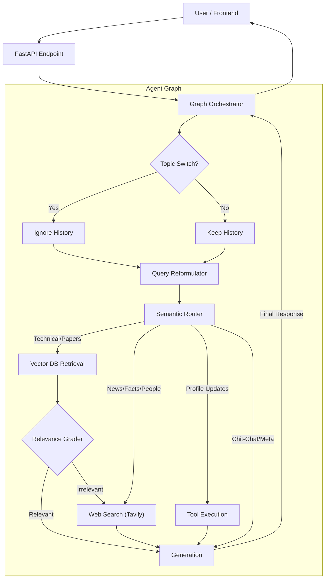

# Production Agent System

This directory contains a modular, production-ready architecture for an **Agentic RAG System**. Unlike simple linear pipelines, this system uses a **Graph-based Orchestrator** (LangGraph) to dynamically decide the best course of action for each user query.

## 🧠 System Workflow (Step-by-Step)

1.  **Topic Check**: The system first checks if the new query is related to the previous conversation. If the topic has changed (e.g., switching from "Bitcoin" to "Elon Musk"), it ignores the previous history to prevent confusion.
2.  **Reformulation**: It rewrites the user's query to be self-contained (e.g., "How much is it?" $\rightarrow$ "How much is Bitcoin?").
3.  **Routing**: A specialized "Router Agent" classifies the intent:
    *   **Database**: For technical questions about LLMs/Agents.
    *   **Web Search**: For current events, stocks, or specific facts about people/companies.
    *   **Tools**: For updating user profile info.
    *   **General**: For chit-chat or questions about the conversation history itself.
4.  **Retrieval & Grading**:
    *   If **Database** is chosen, it retrieves documents and **Grades** them. If they are irrelevant, it falls back to **Web Search**.
5.  **Generation**: The LLM generates a final answer using the retrieved context (if any), strictly adhering to the facts provided.

## 🏗️ Architecture

The system follows a **Router-based Agentic Workflow**:



## � Technical Deep Dive

### 1. Query Reformulation & Topic Detection
Before any retrieval happens, the system performs two critical checks:
*   **Topic Switch Detection**: An LLM-based grader compares the current query with the last user message. If the semantic topic has shifted (e.g., from "Python" to "Weather"), the short-term memory is cleared for the reformulation step to prevent "topic bleeding."
*   **Coreference Resolution**: If the topic is consistent, the **Query Reformulator** rewrites the query to resolve pronouns (e.g., "How much is **it**?" $\rightarrow$ "How much is **Bitcoin**?"). This ensures the retrieval step searches for the correct entities.

### 2. Hybrid Retrieval & Re-Ranking
The system uses a two-stage retrieval process for maximum accuracy:
*   **Hybrid Search**: We use **Qdrant** to perform both dense vector search (semantic meaning) and sparse vector search (keyword matching/SPLADE). This catches both conceptual matches and specific acronyms.
*   **Cross-Encoder Re-Ranking**: The top 10 results are passed to a **ReRanker** (`BAAI/bge-reranker-base`). This model scores every (Query, Document) pair to strictly order them by relevance, discarding the "pseudo-relevant" results that vector search often returns.

### 3. Relevance Grading (The Judge)
To prevent hallucinations, we implement an **"LLM-as-a-Judge"** pattern.
*   After retrieval, a specialized prompt asks the LLM: *"Does this document actually answer the user's question?"*
*   If the answer is **No**, the system discards the vector DB results and automatically falls back to **Web Search**. This prevents the agent from trying to answer "Who is the CEO of Tesla?" using Python code files.

### 4. Memory Management
*   **Short-Term Memory**: Implemented using `ConversationSummaryBufferMemory`. It keeps recent messages raw but summarizes older ones to save context window space.
*   **State Management**: The `GraphOrchestrator` maintains a strictly typed `AgentState` that persists across the graph nodes, ensuring thread safety and clear data flow.


## 📂 Component Breakdown

### 1. Frontend (`frontend/`)
- **`api.py`**: The entry point. Uses **FastAPI** to expose the REST API. It initializes the `GraphOrchestrator` and loads environment variables (including API keys).
- **`templates/index.html`**: A clean web interface for chatting with the agent.

### 2. Controller (`controller/`)
- **`graph_orchestrator.py`**: The new "brain" of the system, built with **LangGraph**.
    -   Manages the state of the conversation (`AgentState`).
    -   Defines the nodes (Reformulate, Route, Retrieve, Search, Generate) and conditional edges.
    -   Prevents hallucinations by strictly controlling when tools are called.

### 3. Components (`components/`)
These are specialized classes that handle specific tasks.

-   **`router.py`**: A specialized agent that classifies user intent into 4 categories:
    1.  **DATABASE**: Technical queries (triggers RAG).
    2.  **WEB**: Current events/news (triggers Tavily Search).
    3.  **TOOL**: Profile updates (triggers `update_user_info`).
    4.  **GENERAL**: Conversational chit-chat.

-   **`web_search.py`**: Integrates **Tavily API** to perform real-time web searches when the local database is insufficient.

-   **`query_reformulator.py`**: Uses the LLM to rewrite vague follow-up questions (e.g., "How does it work?") into standalone queries based on chat history.

-   **`retriever.py`**: Handles communication with **Qdrant**.
    -   Implements **Hybrid Search** (Dense + Sparse Embeddings).
    -   Uses persistent model storage in `fastembed_storage/` to avoid re-downloading models.

-   **`short_term_memory.py`**: Manages conversation history using LangChain's `ConversationSummaryBufferMemory`.

-   **`prompt_gen.py`**: Constructs the final prompt, injecting context from RAG or Web Search results into the system message.

-   **`llm.py`**: The interface for the Large Language Model (supports Ollama/Llama 3.2 and OpenAI).
-   **`relevance_grader.py`**: The "Judge" that evaluates if retrieved documents are actually relevant to the query.

### 4. Utilities (`utils/`)
-   **`logger.py`**: Centralized color-coded logging for debugging.
-   **`fallback.py`**: Handles errors gracefully (e.g., if retrieval fails) to ensure the user always gets a response instead of a crash.

## 🚀 How to Run

### Prerequisites
1.  **Environment Setup**:
    Create a `.env` file in the project root:
    ```env
    TAVILY_API_KEY=tvly-xxxxxxxxxxxx
    OPENAI_API_KEY=sk-xxxxxxxx (Optional, if not using Ollama)
    LANGFUSE_PUBLIC_KEY=pk-lf-xxxxxxxx
    LANGFUSE_SECRET_KEY=sk-lf-xxxxxxxx
    LANGFUSE_HOST=http://localhost:3000
    ```

2.  **Docker Services**:
    Ensure Qdrant and Ollama are running:
    ```powershell
    docker-compose up -d
    ```

    **Important:** You must pull the Llama 3.2 model for Ollama to work:
    ```powershell
    docker exec -it ollama ollama pull llama3.2
    ```

    Ensure langfuse is running. For Langfuse install instructions go to the Observability (Langfuse) section.
    ```powershell
    cd langfuse_docker
    docker-compose up -d
    cd ..
    ```

3.  **Python Environment**:
    ```powershell
    .\venv\Scripts\Activate.ps1
    .\setup.ps1
    ```
    *Note: The `setup.ps1` script automatically handles the installation of `onnxruntime-directml` and removes conflicting packages to ensure GPU acceleration works.*

    ```powershell
    pip install --force-reinstall onnxruntime-directml
    ```

4.  **Start the Server**:
    ```powershell
    python production_agent_system/main.py
    ```

## 🛠️ Observability (Langfuse)

This project uses **Langfuse** for tracing agent steps and LLM calls. Since Langfuse runs in its own Docker stack, follow these steps to set it up.

### 1. Installation & Setup
1.  **Clone the Langfuse Repository**:
    Run this in the project root to create a separate folder for Langfuse:
    ```powershell
    git clone https://github.com/langfuse/langfuse.git langfuse_docker
    ```

2.  **Start Langfuse**:
    ```powershell
    cd langfuse_docker
    docker-compose up -d
    cd ..
    ```

3.  **Configure Keys**:
    -   Go to [http://localhost:3000](http://localhost:3000).
    -   Create an account and a new project.
    -   Go to **Settings > API Keys** and generate new keys.
    -   Add them to your `.env` file:
        ```env
        LANGFUSE_PUBLIC_KEY=pk-lf-xxxxxxxx
        LANGFUSE_SECRET_KEY=sk-lf-xxxxxxxx
        LANGFUSE_HOST=http://localhost:3000
        ```

### 2. Managing Services (Up/Down)

Since we have two separate Docker setups (one for the Agent's infrastructure and one for Langfuse), you need to manage them separately.

**Start Everything:**
```powershell
# 1. Start Ollama & Qdrant (Agent Infrastructure)
docker-compose up -d

# 2. Start Langfuse (Observability)
cd langfuse_docker
docker-compose up -d
cd ..
```

**Stop Everything:**
```powershell
# 1. Stop Agent Infrastructure
docker-compose down

# 2. Stop Langfuse
cd langfuse_docker
docker-compose down
cd ..
```
    Access the UI at `http://127.0.0.1:8000`.

## 🧠 Key Features
-   **Adaptive Routing**: Doesn't just RAG everything. It knows when to search the web or just talk.
-   **Self-Correction**: If a tool doesn't exist, the system catches the error and instructs the LLM to answer directly.
-   **Persistent Caching**: Embedding models are cached locally to speed up startup.
-   **Hybrid Search**: Combines semantic understanding with keyword matching for better retrieval accuracy.


### How I avoided the "Topic Bleeding"
When a user sends a message:

- The system first checks if the message is relevant to the previous conversation context.
- If the similarity score is low (e.g., user switches from "What is RL?" to "Search for stock prices"), the system detects this as a topic switch.
- It clears the short-term memory, effectively starting a new session.
- The query is then processed as a standalone question, preventing "topic bleeding" (e.g., the reformulator won't try to combine "stock prices" with "RL").