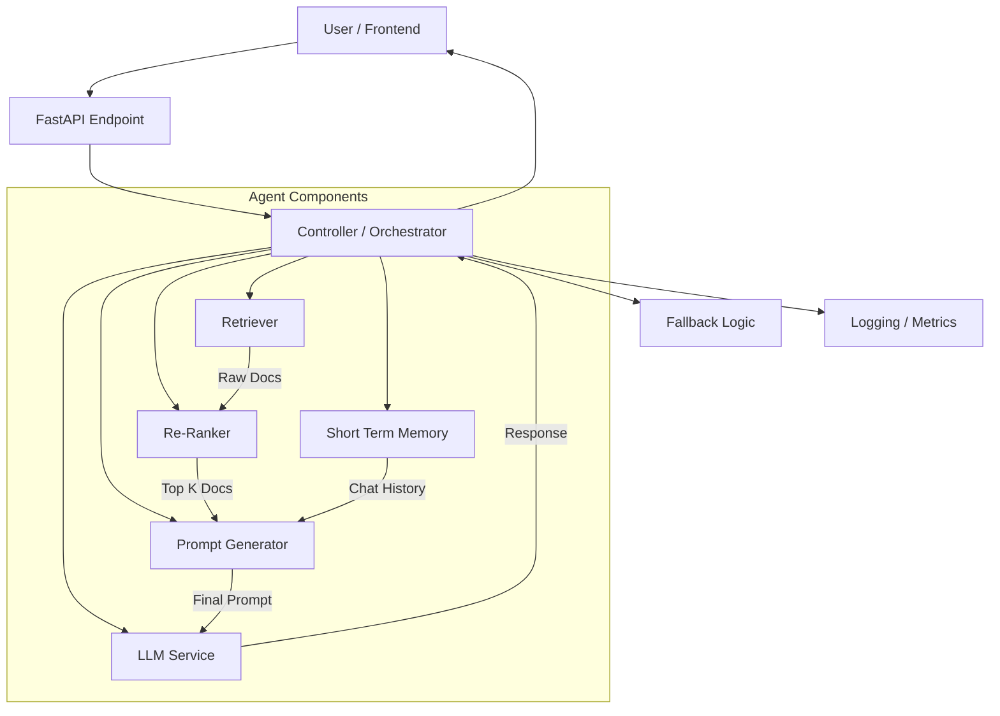

# Production Agent System

This directory contains a modular, production-ready architecture for a RAG (Retrieval-Augmented Generation) agent. It separates concerns into distinct components, controlled by a central orchestrator.

## 🏗️ Architecture

The system follows a linear pipeline architecture orchestrated by a central controller:



## 📂 Component Breakdown

### 1. Frontend (`frontend/`)
- **`api.py`**: The entry point for the web server. It uses **FastAPI** to expose a REST API (`POST /query`) and serves the HTML UI. It initializes the `Orchestrator` and passes user queries to it.
- **`templates/index.html`**: A clean, responsive web interface for chatting with the agent. It handles sending requests to the API and rendering the markdown response and source citations.

### 2. Controller (`controller/`)
- **`orchestrator.py`**: The "brain" of the operation. It does not contain business logic itself but coordinates the flow of data between components.
    1.  Receives query.
    2.  Calls **Retriever** to get documents.
    3.  Calls **Re-Ranker** to filter/sort documents.
    4.  Fetches history from **STM**.
    5.  Calls **Prompt Generator** to create the context window.
    6.  Calls **LLM** to generate the answer.
    7.  Updates **STM** with the new interaction.
    8.  Handles errors via **Fallback**.

### 3. Components (`components/`)
These are specialized classes that handle specific tasks.

-   **`retriever.py`**: Handles communication with the **Qdrant** vector database.
    -   Implements **Hybrid Search** using Dense Embeddings (`BAAI/bge-large-en-v1.5`) and Sparse Embeddings (`prithivida/Splade_PP_en_v1`).
    -   Returns a list of raw documents relevant to the query.

-   **`reranker.py`**: Responsible for refining the retrieved documents.
    -   *Current State*: A pass-through that slices the top K results.
    -   *Future State*: Can be upgraded to use a Cross-Encoder (like BGE-Reranker) to semantically score documents and discard irrelevant ones before they hit the LLM context window.

-   **`stm.py` (Short Term Memory)**: Manages the conversation history.
    -   Stores the last $N$ turns of conversation.
    -   Ensures the LLM "remembers" previous questions in the current session.

-   **`prompt_gen.py`**: Constructs the actual text sent to the LLM.
    -   Combines the **System Instruction**, **Retrieved Context**, **Chat History**, and **User Question** into a single formatted prompt.

-   **`llm.py`**: The interface for the Large Language Model.
    -   Supports **Local LLMs** (via Ollama/LM Studio) and **OpenAI**.
    -   Abstracts the specific API calls so you can swap models easily.

### 4. Utilities (`utils/`)
-   **`fallback.py`**: Provides graceful degradation. If the database is down, or no documents are found, this component ensures the user gets a helpful message instead of a raw 500 Server Error.
-   **`logger.py`**: A centralized logging utility with color-coded output to help debug the flow of the application in the terminal.

## 🚀 How to Run

### Prerequisites
Ensure your Docker containers (Qdrant & Ollama) are running:
```powershell
docker-compose up -d
```

2. Venv
    ```bash
    .\venv\Scripts\Activate.ps1
    ```

3.  **Install Dependencies:**
    ```bash
    pip install -r requirements.txt
    ```

4.  **Pip Installs:**
    ```bash
    pip uninstall -y onnxruntime
    pip install --force-reinstall onnxruntime-directml
    ```

5.  **Run production.py:**
    ```bash
    python production_agent_system/main.py
    ```

6.  **Access the UI**:
    Open your browser to [http://127.0.0.1:8000](http://127.0.0.1:8000).
    # what is the crucial aspect of embodied intelligence tasks is?


    next think there will be a general ai agent will get the question and decied whihc tool to use. After getting a response from the tool, it will rank the quality of the reponse. If the response is not accaptable it will go to the second and third preffered tool. All the responds will be compared and the main agent will choose which one is a better answer based on the question and save it in the context window for Short time memory, and give it as the response.